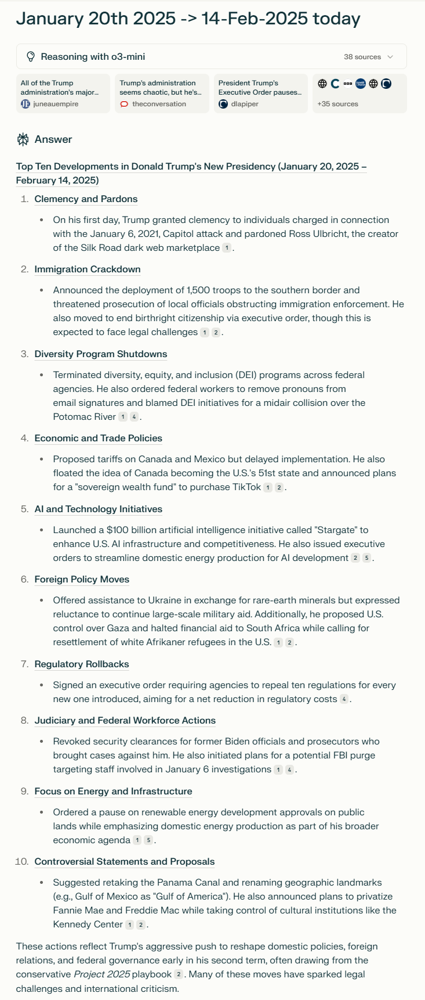

|  | **Top Ten Developments in Donald Trump's New Presidency (January 20, 2025 – February 14, 2025)**  |
|------------------------------------------------|------------------------------------------------------------|
|  | **1. Clemency and Pardons**  |
|  | On his first day, Trump granted clemency to individuals charged in connection with the January 6, 2021, Capitol attack and pardoned Ross Ulbricht, the creator of the Silk Road dark web marketplace.  |
|  | **2. Immigration Crackdown**  |
|  | Announced the deployment of 1,500 troops to the southern border and threatened prosecution of local officials obstructing immigration enforcement. He also moved to end birthright citizenship via executive order, though this is expected to face legal challenges.  |
|  | **3. Diversity Program Shutdowns**  |
|  | Terminated diversity, equity, and inclusion (DEI) programs across federal agencies. He also ordered federal workers to remove pronouns from email signatures and blamed DEI initiatives for a midair collision over the Potomac River.  |
|  | **4. Economic and Trade Policies**  |
|  | Proposed tariffs on Canada and Mexico but delayed implementation. He also floated the idea of Canada becoming the U.S.'s 51st state and announced plans for a "sovereign wealth fund" to purchase TikTok.  |
|  | **5. AI and Technology Initiatives**  |
|  | Launched a $100 billion artificial intelligence initiative called "Stargate" to enhance U.S. AI infrastructure and competitiveness. He also issued executive orders to streamline domestic energy production for AI development.  |
|  | **6. Foreign Policy Moves**  |
|  | Offered assistance to Ukraine in exchange for rare-earth minerals but expressed reluctance to continue large-scale military aid. Additionally, he proposed U.S. control over Gaza and halted financial aid to South Africa while calling for resettlement of white Afrikaner refugees in the U.S.  |
|  | **7. Regulatory Rollbacks**  |
|  | Signed an executive order requiring agencies to repeal ten regulations for every new one introduced, aiming for a net reduction in regulatory costs.  |
|  | **8. Judiciary and Federal Workforce Actions**  |
|  | Revoked security clearances for former Biden officials and prosecutors who brought cases against him. He also initiated plans for a potential FBI purge targeting staff involved in January 6 investigations.  |
|  | **9. Focus on Energy and Infrastructure**  |
|  | Ordered a pause on renewable energy development approvals on public lands while emphasizing domestic energy production as part of his broader economic agenda.  |
|  | **10. Controversial Statements and Proposals**  |
|  | Suggested retaking the Panama Canal and renaming geographic landmarks (e.g., Gulf of Mexico as "Gulf of America"). He also announced plans to privatize Fannie Mae and Freddie Mac while taking control of cultural institutions like the Kennedy Center.  |

These actions reflect Trump's aggressive push to reshape domestic policies, foreign relations, and federal governance early in his second term, often drawing from the conservative *Project 2025* playbook. Many of these moves have sparked legal challenges and international criticism.
